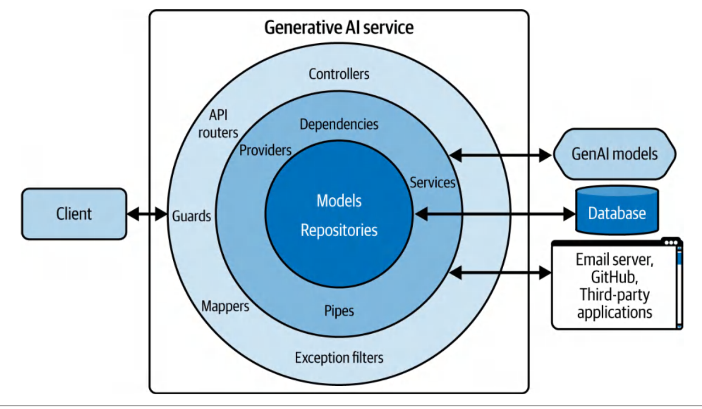

# fast_api_tutorial

BOOK: Building GenerativeAI services with FastAPI : https://www.oreilly.com/library/view/building-generative-ai/9781098160296/

## FastAPI offers these features out of the box:

- data validation
- type safety
- automatic documentation
- built in web server

## Challenges around the adoption of GenAI services

- inaccuracy
- relevance
- quality
- consistency
- data privacy
- cybersecurity
- potential abuse and misuse

of outputs.

## Intro to FastAPI

#### FastAPI is an asynchronous gateway interface(ASGI) web framework, that enables to build lean APIs and backend web servers.

#### Installation

```
pip install "fastapi[standard]" uvicorn openai

```

- `uvicorn` package is the bare-bones web server that FastAPI runs on.

- The app object—which is created from the FastAPI class—converts your Python
  function with a decorator into a Hypertext Transfer Protocol (HTTP) endpoint. You
  can trigger both endpoints by sending an HTTP request.

#### Terminology

- thread
- synchronous and asynchronous workflow
- concurrency

#### Lifespan events

#### Security and Authentical Components

#### Bidirectional Web Socket, GraphQL, and Custom Response Support

---

### FastAPI Project Structure

- unlike opinionated frameworks like Djano, with nonopinionated framework like FastAPI you may need to follow good practices for having success.

- learning to structure large applications maybe even more important when working with GenerativeAI models.

-You know you have a good project structure if you can find any function or component within your codebase.

#### POPULAR FASTAPI PROJECT STRUCTURES

##### -FLAT

Advantages: most common due to its simplicity. When you are building an initial version of your application or building a simple microservice, by default you want to go for the Flat structure.

Disadvantages: However, if your projects grows over time it is going to be increasingly difficult to maintain and manage your application. this care it is bast to next your modules and dependencies in their own "block"

```
flat-project
├── app
│ ├── services.py
│ ├── database.py
│ ├── models.py
│ ├── routers.py
│ └── main.py
├── requirements.txt
├── .env
├── .gitignore
```

##### - NESTED

groups similar modules into packages - effectively creating a nested structure and hierarchy of modules.

You group all the models that are similar in nature into a single package, irrespective of the fuature they support.

```
nested-project
├── app
│ ├── main.py
│ ├── dependencies.py
│ └── services
│ │ ├── users.py
│ │ └── profiles.py
│ └── models
│ │ ├── users.py
│ │ └── profiles.py
│ └── routers
│ ├── users.py
│ └── profiles.py
├── requirements.txt
├── .env
├── .gitignore
```

The main pitfall with this project structure is the ambiguous coupling of modules. Changes in one module can cascade into other modules, and it can become difficult to understand the cascading effect of new changes. Over time, it can be challenging to maintain and change the code without performing many updates everywhere else. This is referred to as shotgun updates. Shotgun updates in the context of software development are when it is challenging to maintain and change the code without per‐
forming many updates everywhere else.

<strong>Shotgun Update</strong> - a shotgun update (often called shotgun surgery) is a code smell that occurs when a single, simple, logical change requires numerous, scattered modifications across many different classes, files, or modules.

##### - MODULAR

If you expect difficulty managing module coupling or expecting to deal with a large application, I would recommend using a modular structure.

<strong>The modular structure</strong>—popularized by the Netflix Dispatch FastAPI project—is similar to the nested structure because you can place multiple modules within a package and subpackages. However, the core difference is in how you organize your project.

In the modular structure, modules that are closely related and refer to a specific domain are grouped together.

```
modular-project
├── app
│ └── modules
│ │ ├── auth
│ │ │ ├── routers.py
│ │ │ ├── models.py
│ │ │ ├── dependencies.py
│ │ │ ├── guards.py
│ │ │ ├── services.py
│ │ └── users
│ │ │ ├── router.py
│ │ │ ├── models.py
│ │ │ ├── dependencies.py
│ │ │ ├── services.py
│ │ │ ├── mappers.py
│ │ │ ├── pipes.py
│ │ └── profiles
│ └── routers
│ │ └── users.py
│ └── providers
│ │ └── email.py
│ │ └── stripe.py
............
│ ├── settings.py # global configs
│ ├── middlewares.py # global middleware
│ ├── models.py # global models
│ ├── exceptions.py # global exceptions
│ └── main.py
├── requirements.txt
├── .env
├── .gitignore
```

---

you may be asking yourself, “Which project structure should I
adopt for building generative AI services with FastAPI?”

I found that the best way to structure projects is to progressively reorganize your
project from a flat to a modular structure as your service complexity grows.

Thinking about the structure of your large FastAPI application is only the first step in
building production-grade services. In the next step, you will learn more about a soft‐
ware design pattern that helps you manage the complexity of your AI services. This is
called the onion, or layered, application design pattern, which we will talk about next.

### Onion/Layered Application Design Pattern

- Can be implemented in the nested or modular structures.
- The purpose of this pattern is to create a separation of concerns between the different parts of your
  application to simplify the process of adding, removing, and modifying features.


Figure 2-3. Onion design pattern

- The main idea behind this pattern is the <strong>dependency inversion principle</strong>

[](https://youtu.be/9oHY5TllWaU)

Thread, THread pool, WSGI vs ASGI(asynchronous Server Gateway Interface)
[![WSGI & ASGI]](https://youtu.be/LtpJup6vcS4)

#### Fast API Limitations

<strong>Inefficinet Model Memory Mangement</strong>
FastAPI does provide built-in mechanisms for sharing model memory between mul‐
tiple instances or processes of the same container. This means when scaling web
workers horizontally, you need to load a whole new model instance into the contain‐
er’s memory. This creates a memory bottleneck and increases operational costs of
high-traffic GenAI services.

<strong>Limited Number of Threads</strong>
There is a limit to the number of threads that FastAPI creates on application startup
in the internal thread pool.
This means there is also a limit to how much you can scale a single instance of
FastAPI, especially with AI workloads that have heavy I/O as well as CPU/GPU-
intensive operations.

<strong>Restricted to Global Interpreter Lock</strong>
In Python, multithreading can produce unintuitive and often counterproductive
results because of the Global Interpreter Lock (GIL).
FastAPI leverages multithreading via an internal thread pool to handle concurrent
web requests hitting a synchronous route. However, even with asynchronous end‐
points, the AI inference requests can still block the main event loop, preventing all
other requests from being processed in the main web serving thread.

This is because AI inference workloads are CPU/GPU intensive. Non-I/O operations,
such as serving an expensive model or aggregating large amounts of data on a worker,
will cause other threads to wait as Python currently is not using multiple cores for
threading.10 Instead, as you’ll learn more in Chapter 5, for these kinds of expensive
compute operations, you’ll need to use multiprocessing or a process pool instead.

<strong>Lack of Support for Micro-Batch Processing Inference Requrests</strong>
Deep learning frameworks provide support for vectorization so that inferences can be
batched together, efficiently computed, and parallelized. Unfortunately, prediction
requests can’t be batched together in FastAPI, and as a result, each compute-intensive
model inference operation can block other requests.
When scaling services, a solution is to serve heavy models separately and use FastAPI
to authenticate and manage the incoming and outgoing data.

<strong>Cannot Efficiently Split AI Workloads Between CPU and GPU</strong>
While the CPU mostly handles request transformation and validation operations, the
GPU can run and parallelize compute-intensive model inference. In some specialized
ML web frameworks (like BentoML), you can also efficiently split AI workloads
between the CPU and GPU.

Unfortunately, FastAPI can’t efficiently perform this split of the AI inference work‐
load between these devices. This means your CPU can be blocked from processing
requests even when inference processes are running on the GPU. As this is a big bot‐
tleneck when working with heavier models, it will require serving heavier models
outside FastAPI for concurrent workloads

<strong>Dependency Conflicts</strong>
When you are deploying ML models, you will face unique challenges compared to
deploying typical web applications. This is due to your model runtime’s deep cou‐
pling with native libraries and hardware. Each deployment environment can operate
on distinct hardware and may require you to use specific versions of native libraries
and containerization commands.

<strong>Lack of Support for Resource intensive AI workloads</strong>
Despite its incredible capabilities, FastAPI was developed before the rise of generative
AI. As a result, it remains a general-purpose web framework with recent support for
AI serving and ML workflows. However, for certain use cases, such as serving
resource-intensive and complex billion-parameter models, it may be worth exploring
other frameworks like BentoML.
