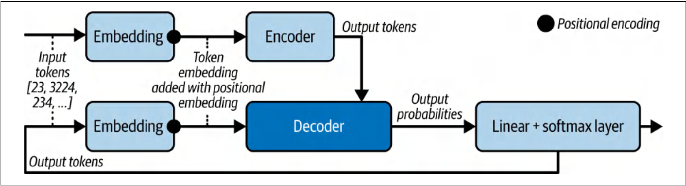

<strong>Chapter Goals</strong>

• How different GenAI models work
• How to integrate and serve generative models into FastAPI
• How to work with text, image, audio, video, and 3D models
• How to quickly build a user interface for prototyping
• Several model-serving strategies in FastAPI
• How to leverage middleware for service monitoring

---

<strong>Transformers versus recurrent neural networks</strong>

Simplified version of proposed Transformer Architecture:

